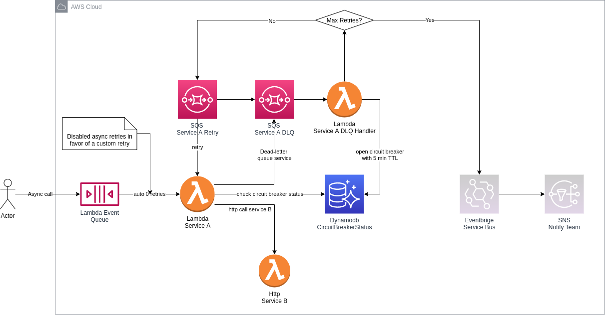

# Introduction

A simple AWS Lambda resilience example implementation





## Features

* Circuit Breaker with DynamoDB and TTL Specification
* Custom SQS retry control with messageAttributes
* Dead Letter Queue

---
**NOTE**

It works only with asynchronous Lambda calls.

**TODO**
* Add ExpireTimeStamp as Sorted Key and filter the expired rows, because the TTL would delay over 48 hours depending on table structure and registries
* Add EventBridge integration when retries exceed
* Add different treatments depending on the exception, some errors do not makes sense retry
---


## Requirements
* aws-cli/2.0.56 
* Python/3.7.3
* aws sam cli 1.15.0

## Components

### dlq_helper
AWS Lambda Layer with helper functions for DLQ retry and Circuit Breaker.

### dlq_handler
AWS Lambda that control when should retry and open the circuit

### service_a
AWS Lambda A, simulating a simple service that calls another service (b). The service b it is a mock function

## AWS Deploy with SAM
```bash
make deploy
```

## AWS Test with AWS Cli
```bash
# update function name inside Makefile, before execute
make invoke
```
